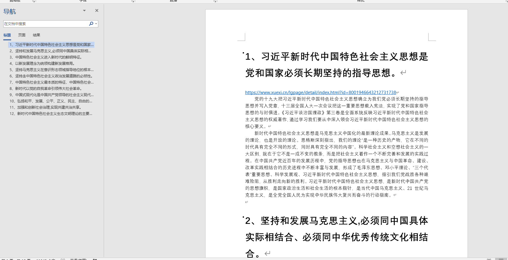

># 记得点star

gitee地址 https://gitee.com/xiangchengkang/qimo_ncu

github地址 https://github.com/2043766637/-_-_ncu

# 1、习近平新时代中国特色社会主义思想是党和国家必须长期坚持的指导思想。

<https://www.xuexi.cn/lgpage/detail/index.html?id=8001946643212731738>

党的十九大把习近平新时代中国特色社会主义思想确立为我们党必须长期坚持的指导思想并写入党章，十三届全国人大一次会议把这一重要思想载入宪法，实现了党和国家指导思想的与时俱进。《习近平谈治国理政》第三卷是全面系统反映习近平新时代中国特色社会主义思想的权威著作，通过学习我们要从中深入领会习近平新时代中国特色社会主义思想的核心要义。

新时代中国特色社会主义思想是马克思主义中国化的最新理论成果。马克思主义是发展的理论，也是开放的理论。恩格斯深刻指出，我们的理论“是一种历史的产物，它在不同的时代具有完全不同的形式，同时具有完全不同的内容”。科学社会主义和空想社会主义的一大区别，就在于它不是一成不变的教条，而是把社会主义看作一个不断完善和发展的实践过程。在中国共产党近百年的发展历程中，党的指导思想也在马克思主义与中国革命、建设、改革实践相结合的历史进程中不断丰富与发展，形成了毛泽东思想、邓小平理论、“三个代表”重要思想、科学发展观、习近平新时代中国特色社会主义思想，指引我们党战胜各种艰难险阻，从胜利走向新的胜利。习近平新时代中国特色社会主义思想，是新时代中国共产党的思想旗帜，是国家政治生活和社会生活的根本指针，是当代中国马克思主义、21世纪马克思主义，是全党全国人民为实现中华民族伟大复兴而奋斗的行动指南。

 

# 2、坚持和发展马克思主义,必须同中国具体实际相结合、必须同中华优秀传统文化相结合。

http://www.qstheory.cn/wp/2022-10/27/c_1129082574.htm

坚持和发展马克思主义，必须同中国具体实际相结合。习近平总书记强调，“坚持以马克思主义为指导，是要运用其科学的世界观和方法论解决中国的问题，而不是要背诵和重复其具体结论和词句，更不能把马克思主义当成一成不变的教条”。当前，世界之变、时代之变、历史之变正以前所未有的方式展开，我国发展面临新的战略机遇、新的战略任务、新的战略阶段、新的战略要求、新的战略环境。坚持和发展马克思主义，必须坚持解放思想、实事求是、与时俱进、求真务实，一切从实际出发，着眼解决新时代改革开放和社会主义现代化建设的实际问题，不断回答中国之问、世界之问、人民之问、时代之问，作出符合中国实际和时代要求的正确回答，得出符合客观规律的科学认识，形成与时俱进的理论成果，更好指导中国实践。

坚持和发展马克思主义，必须同中华优秀传统文化相结合。2021年3月，福建武夷山九曲溪畔，习近平总书记走进朱熹园，发出这样的感叹：“如果没有中华五千年文明，哪里有什么中国特色？如果不是中国特色，哪有我们今天这么成功的中国特色社会主义道路？”只有植根本国、本民族历史文化沃土，马克思主义真理之树才能根深叶茂。中华优秀传统文化源远流长、博大精深，是中华文明的智慧结晶，其中蕴含的天下为公、民为邦本、为政以德、革故鼎新、任人唯贤、天人合一、自强不息、厚德载物、讲信修睦、亲仁善邻等，是中国人民在长期生产生活中积累的宇宙观、天下观、社会观、道德观的重要体现，同科学社会主义价值观主张具有高度契合性。坚持和发展马克思主义，必须坚定历史自信、文化自信，坚持古为今用、推陈出新，把马克思主义思想精髓同中华优秀传统文化精华贯通起来、同人民群众日用而不觉的共同价值观念融通起来，不断赋予科学理论鲜明的中国特色，不断夯实马克思主义中国化时代化的历史基础和群众基础，让马克思主义在中国牢牢扎根。

先进的思想总是与非凡的事业彼此辉映，科学的理论总是与伟大的实践相互激荡。新时代新征程，继续把马克思主义基本原理同中国具体实际相结合、同中华优秀传统文化相结合，不断推进马克思主义中国化时代化，马克思主义必将焕发更璀璨的真理光芒。

 

 

# 3、中国特色社会主义进入新时代的鲜明特征。

书Page25

 

 

 

# 4、以新发展理念为统领构建新发展格局。

<https://baijiahao.baidu.com/s?id=1741911301099072495&wfr=spider&for=pc>

新发展理念是党和国家事业发展必须长期坚持和全面贯彻的基本方略，全面把握新发展理念的内涵与逻辑，有利于将新发展理念贯穿发展的全过程和各领域，加快构建新发展格局，实现更高质量、更有效率、更加公平、更可持续、更为安全的发展，为顺利推进民族复兴和现代化进程提供强大的动力支撑。

*贯彻新发展理念，要提升认知高度。*认识的高度决定行动的深度。发展理念决定着道路问题、方向问题，从根本上决定着发展成效乃至发展成败。新发展理念来源于实践，体现了事物发展运动的规律，对指导和推动全面建设社会主义现代化国家具有全局和长远的意义，我们要进一步深化认识，深刻理解新发展理念的科学内涵和精神实质，自觉将之作为推动发展的“指挥棒”和“风向标”。

*贯彻新发展理念，要强化践行力度。*当前，我国进入新发展阶段，国内改革发展稳定任务更加艰巨繁重，国际形势不确定性因素增多，特别是新冠疫情的冲击仍在持续，我们必须要敢于担当、善于作为、久久为功，不断提高践行新发展理念的能力和水平，把践行新发展理念的各项要求融入并落实到奋斗目标中去，才能有力化解新征程上的各种挑战、冲突和难题，才能始终保持正确的行进方向。

*贯彻新发展理念，要注重统筹广度。*在新发展理念的内涵中，创新、协调、绿色、开放、共享这五大发展理念既相互贯通又相互促进，是一个辩证统一具有内在联系的集合体。五大发展理念及其推动解决的问题，都是我经济社会发展的根本性、全局性、长远性的问题。在实践中，哪一个发展理念贯彻不到位，发展进程都会受到影响。因此，对这五大发展理念要做到一体把握、全局统筹、协同推进、联动共发展，不能顾此失彼，也不能相互替代。

“天地之大，黎元为本”，新发展理念旨在通过创新实现平衡发展，促进人与自然和谐共生，并最终实现共同富裕，其落脚点在于人。我们要不断提升认知高度，强化践行力度，注重统筹广度，才能使新发展理念牵引高质量发展、推动高效能治理、创造高品质生活，不断满足人民群众对美好生活的向往和追求。

 

 

# 5、坚持马克思主义在意识形态领域指导地位的根本制度的重要性。

<https://view.inews.qq.com/a/20221116A05EJL00>  或者书page142

习近平总书记在党的二十大报告中强调，“要坚持马克思主义在意识形态领域指导地位的根本制度”，体现了我们党在领导文化建设长期实践中积累的成功经验和形成的方针原则，对于铸就社会主义文化新辉煌、建设社会主义文化强国具有重要指导意义。

是我们立党立国、兴党兴国的根本指导思想，是社会主义意识形态的旗帜和灵魂。我们党领导文化建设的长期实践表明，只有坚持马克思主义在意识形态领域的指导地位，才能确保我们党始终保持思想上的统一、政治上的团结、行动上的一致，确保全体人民始终在理想信念、价值理念、道德观念上紧紧团结在一起，确保我们国家在党的集中统一领导下始终沿着社会主义方向前进。在坚持马克思主义指导地位这一根本问题上，我们必须坚定不移，任何时候任何情况下都不能有丝毫动摇。

把马克思主义在意识形态领域的指导地位制度化，并将其作为一项根本制度，这是关系党和国家事业长远发展、关系我国文化前进方向和发展道路的重大制度创新。党的十八大以来，以习近平同志为核心的党中央确立和坚持马克思主义在意识形态领域指导地位的根本制度，新时代党的创新理论深入人心，社会主义核心价值观广泛传播，中华优秀传统文化得到创造性转化、创新性发展，文化事业日益繁荣，网络生态持续向好，意识形态领域形势发生全局性、根本性转变。实践证明，坚持马克思主义在意识形态领域指导地位的根本制度，是中国特色社会主义制度的重要支撑，是坚持和加强党对宣传文化事业全面领导的本质要求，是发展社会主义先进文化的有力保障。

党的二十大描绘了全面建设社会主义现代化国家、全面推进中华民族伟大复兴的宏伟蓝图。把宏伟蓝图变为美好现实，必须增强实现中华民族伟大复兴的精神力量。当前，我国发展进入战略机遇和风险挑战并存、不确定难预料因素增多的时期，社会思想观念多样，社会价值取向多元，社会思潮纷繁复杂，统一思想、坚定信心、凝聚力量的任务更加凸显。面对这样的形势和任务，我们必须牢牢坚持马克思主义在意识形态领域指导地位的根本制度，不断夯实共同的思想基础，拉紧共同的精神纽带，促进全体人民在思想上精神上紧紧团结在一起，更好汇集起攻坚克难、开拓前行的磅礴伟力。要增强政治自觉和思想自觉，强化制度意识、抓好制度执行，切实把这一根本制度贯穿到文化建设各方面，体现到坚持正确的政治方向、舆论导向、价值取向上，落实到工作理念、思路、举措上，不断提升国家文化软实力和中华文化影响力。

坚持马克思主义在意识形态领域指导地位的根本制度，第一位的要求就是推动全党全社会全面贯彻落实习近平新时代中国特色社会主义思想。习近平新时代中国特色社会主义思想是当代中国马克思主义、二十一世纪马克思主义，是中华文化和中国精神的时代精华，是新时代坚持和发展中国特色社会主义的行动指南。要坚定不移用这一思想武装头脑、指导实践、推动工作，自觉地用以统领新时代文化建设，不断巩固全党全国各族人民团结奋斗的共同思想基础。大力引导广大干部群众深刻领会和把握习近平新时代中国特色社会主义思想的世界观、方法论，深刻领会和把握蕴含其中的坚定信仰信念、鲜明人民立场、强烈历史担当、求真务实作风、勇于创新精神和科学思想方法，推动习近平新时代中国特色社会主义思想深入人心，更好把科学理论转化为认识世界、改造世界的强大精神力量。

 

# 6、坚持走中国特色社会主义政治发展道路的必然性。

书page112

 

# 7、中国特色社会主义最本质的特征、中国特色社会主义制度的最大优势是中国共产党领导。

<https://www.12371.cn/2022/09/19/ARTI1663578289393521.shtml?from=groupmessage>

 

第一，从中国特色社会主义的思想渊源来说，中国特色社会主义是社会主义而不是其他什么主义，而科学社会主义就是共产党的“主义”。科学社会主义具有学说、运动、制度3种基本形态，无论是学说转化为运动，还是运动转化为制度，都是在共产党领导下实现的。读一读《共产党宣言》，读一读国际共产主义运动历史，就可以知道：科学社会主义学说的形成发展，同共产党的形成发展同步；科学社会主义运动每推进一步，都是共产党领导人民奋斗的结果；科学社会主义制度的建立和完善，更是在共产党领导下取得的。一部科学社会主义历史，就是共产党领导无产阶级和广大人民不懈奋斗的历史。反之，社会主义国家如果削弱或放弃了共产党的领导，就会改变颜色，就会发生历史性的倒退。因此，“科学社会主义”和“共产党领导”是一体两面的问题；坚持科学社会主义，最为根本的，就是要坚持共产党的领导；科学社会主义最本质的特征，就是共产党领导。中国特色社会主义最本质的特征之所以是中国共产党领导，就在于科学社会主义就是共产党的“主义”。

第二，从中国特色社会主义的历史渊源来说，中国特色社会主义是科学社会主义理论逻辑和中国社会发展历史逻辑的辩证统一，而中国共产党的领导就是实现这两个逻辑辩证统一的关键。中国共产党在指导思想上提出并坚持马克思主义中国化，坚持不懈把马克思主义基本原理同中国具体实际相结合、同中华优秀传统文化相结合，持续探索符合中国国情的正确道路，由此决定了中国共产党特别善于把科学社会主义的基本原则和中国具体实际结合起来，能够创造性地开辟中国特色社会主义道路。事实上，科学社会主义在中国运用和发展的过程，就是中国共产党领导人民建立新中国、建立社会主义制度、开辟中国特色社会主义的历史进程，中国特色社会主义从开创到完善、发展，也是在中国共产党坚强领导下不断推进的。在中国，没有共产党就没有新中国，就没有社会主义，就没有中国特色社会主义。中国特色社会主义最本质的特征之所以是中国共产党领导，就在于中国特色社会主义是由中国共产党在长期的历史探索中开创的。

第三，从中国特色社会主义的历史使命来说，中国特色社会主义使中华民族在实现现代化进程中离民族复兴的目标越来越近了，中国共产党正是中国特色社会主义事业和中华民族伟大复兴的领导核心。中国选择社会主义，选择走中国特色社会主义道路，是历史的选择，是为了实现现代化和实现中华民族伟大复兴。在世界现代化进程中，中国由于错过了第一次工业革命和经济全球化的机会导致落后挨打。1840年鸦片战争以后，中国一步步沦为半殖民地半封建社会，争取民族独立、人民解放和实现国家富强、人民幸福，成为中华民族的两大历史任务。为完成这两大历史任务，实现中华民族伟大复兴，从封建阶级革新派到农民领袖，从资产阶级改良派到革命派，各个阶级、各个政党、各种主张、各种制度都试过了，但都失败了。1921年成立的中国共产党，一开始就把实现共产主义作为党的最高理想和最终目标，义无反顾地承担起民族复兴的历史使命，不仅通过新民主主义革命实现了中国从几千年封建专制政治向人民民主的伟大飞跃，通过社会主义革命和建设实现了一穷二白、人口众多的东方大国大步迈进社会主义社会的伟大飞跃，而且通过改革开放和社会主义现代化建设推进了中华民族从站起来到富起来的伟大飞跃，中国特色社会主义进入新时代中华民族更是迎来了从站起来、富起来到强起来的伟大飞跃，由此团结带领中国人民在建立新中国和建立社会主义制度的基础上开创了中国特色社会主义新天地。中国特色社会主义最本质的特征之所以是中国共产党领导，就在于中国的现代化和民族复兴是在中国共产党领导下在中国特色社会主义道路上实现。

第四，从中国特色社会主义的特征优势来说，中国特色社会主义制度的最大优势就是中国共产党的领导。中国特色社会主义有许多特征和优势，它们不仅表现在道路、理论和文化上，而且集中体现在制度上。“党政军民学，东西南北中，党是领导一切的。”在中国特色社会主义制度中，最根本的就是中国共产党的领导制度。需要指出的是，中国共产党之所以能够“领导一切”，是因为中国共产党和其他政党不一样，不是中国一部分人利益的代表，而是中国最广大人民根本利益的代表。“党”这个词，在英文中是Party，即是一部分人组成并代表一部分人的利益。但中国共产党不是这样的政党，《中国共产党章程》明确指出：“党除了工人阶级和最广大人民群众的利益，没有自己的特殊利益。”这是一个和人民心连心、同呼吸、共命运的党，一个矢志践行为中国人民谋幸福、为中华民族谋复兴的初心使命的党。在中国，坚持中国共产党领导一切的制度，就是各级党委都要坚持总揽全局、协调各方，全心全意为人民服务。因此，中国共产党领导是中国特色社会主义制度的最大优势，也是中国特色社会主义不断完善发展的根本保障。中国特色社会主义最本质的特征之所以是中国共产党领导，就在于中国特色社会主义是由懂得“江山就是人民、人民就是江山”的中国共产党领导的社会主义。

第五，从中国特色社会主义的实践成果来说，中国特色社会主义的历史性奇迹都是在中国共产党领导下创造的。自从中国共产党创造性地提出“走自己的道路，建设有中国特色社会主义”以来，中国不仅在经济、政治、文化、社会和生态文明建设等方面取得了举世瞩目的成就，在改革开放中实现了跨越式发展，成为世界第二大经济体，而且在国内政治风波发生后避免了苏联和东欧国家那样改旗易帜的命运，顶住了以美国为首的西方国家的种种挑衅和施加的压力，并在国际金融危机和新冠肺炎疫情等全球性挑战中经受住了各种考验。中国特色社会主义在自身发展进程中创造的所有业绩，归根到底，都是中国共产党卓越领导的结果。中国特色社会主义最本质的特征之所以是中国共产党领导，就在于改革开放以来中国经济快速发展和社会长期稳定的两大奇迹都是在中国共产党领导下创造的。

第六，从中国特色社会主义的前途命运来说，中国特色社会主义的未来取决于中国共产党领导。中国特色社会主义辉煌的过去，来自于中国共产党的坚强领导；中国特色社会主义正在创造的新辉煌，也在于中国共产党的坚强领导；中国特色社会主义奋力创造的未来辉煌，还要靠中国共产党的坚强领导。中国特色社会主义最本质的特征之所以是中国共产党领导，就在于中国共产党的领导直接关系着中国特色社会主义的性质、方向和命运。

 

 

# 8、新时代以党的自我革命引领伟大社会革命。

书page297

 

# 9、中国式现代化是中国共产党领导的社会主义现代化,既有各国现代化的共同特征,更有基于自己国情的中国特色。

<https://www.ccdi.gov.cn/lswhn/lilun/202211/t20221122_232456.html>

 

**中国式现代化是中国共产党领导的社会主义现代化**

习近平总书记在党的二十大报告中强调：“**中国式现代化，是中国共产党领导的社会主义现代化**”。中国式现代化是中国共产党领导、开创、推动的现代化，是坚持和发展中国特色社会主义的现代化。作为中国式现代化本质要求的重要内容，“坚持中国共产党领导，坚持中国特色社会主义”从历史经验和本质规律角度深刻阐明中国式现代化坚持党的领导的要求和社会主义性质，为推进中国式现代化指明了正确方向。

中国共产党是中国式现代化的领导力量。我们党是在领导人民成功开创、坚持和发展中国特色社会主义的过程中探索和推进中国式现代化的，中国式现代化的“中国式”，从根本上讲就是基于中国特色社会主义形成的。在领导和推进中国式现代化进程中，我们党始终坚持中国式现代化的正确方向，坚持人民主体地位，在不同历史时期明确推进中国式现代化的目标、任务、重点，不断深化对中国式现代化的规律性认识，在中华民族伟大复兴历史进程中不断将中国式现代化推向新阶段和新高度。

我们党团结带领中国人民浴血奋战、百折不挠，创造了新民主主义革命的伟大成就；自力更生、发愤图强，创造了社会主义革命和建设的伟大成就；解放思想、锐意进取，创造了改革开放和社会主义现代化建设的伟大成就。特别是党的十八大以来，以习近平同志为核心的党中央团结带领全党全国各族人民，自信自强、守正创新，创造了新时代中国特色社会主义的伟大成就，为实现中华民族伟大复兴提供了更为完善的制度保证、更为坚实的物质基础、更为主动的精神力量。在新中国成立特别是改革开放以来长期探索和实践基础上，经过党的十八大以来在理论和实践上的创新突破，我们党成功推进和拓展了中国式现代化。

中国特色社会主义是社会主义而不是别的什么主义，中国式现代化是中国共产党领导的社会主义现代化而不是别的什么现代化。坚持中国共产党领导，是中国式现代化最鲜明的特征和最突出的优势，是推进中国式现代化必须坚持的最高原则。坚持中国特色社会主义，深刻体现了中国式现代化的基本性质和发展方向。

**深刻认识中国式现代化的本质要求和中国特色的内在联系**

习近平总书记在党的二十大报告中指出：中国式现代化“**既有各国现代化的共同特征，更有基于自己国情的中国特色**”。深入理解和把握中国式现代化的本质要求，一个重要方面在于将中国式现代化的本质要求与中国特色结合起来，深刻认识和把握两者之间的辩证统一关系。

从“人口规模巨大的现代化”来认识中国式现代化的本质要求。坚持中国共产党领导，坚持中国特色社会主义，发展全过程人民民主，是中国式现代化的本质要求的重要内容。我国14亿多人口整体迈进现代化社会，规模超过现有发达国家人口的总和，艰巨性和复杂性前所未有。推进中国式现代化，必须坚持党的领导，充分发挥党总揽全局、协调各方的领导核心作用。必须坚持中国特色社会主义，充分发挥社会主义集中力量办大事的优势，在统筹兼顾中协调处理好现代化建设各方面各领域的关系。必须发展全过程人民民主，坚持人民主体地位，充分体现人民意志、保障人民权益、激发人民创造活力。

从“全体人民共同富裕的现代化”来认识中国式现代化的本质要求。共同富裕是中国特色社会主义的本质要求，实现全体人民共同富裕是中国式现代化的本质要求的重要内容。党的十八大以来，以习近平同志为核心的党中央科学把握新发展阶段，把逐步实现全体人民共同富裕摆在更加突出的位置，团结带领全党全国各族人民完成脱贫攻坚、全面建成小康社会的历史任务，实现第一个百年奋斗目标。共同富裕是一个长期的历史过程，要着力维护和促进社会公平正义，着力促进全体人民共同富裕，坚决防止两极分化，不断推动人的全面发展、全体人民共同富裕取得更为明显的实质性进展。

从“物质文明和精神文明相协调的现代化”来认识中国式现代化的本质要求。物质富足、精神富有是社会主义现代化的根本要求。实现高质量发展，丰富人民精神世界，是中国式现代化的本质要求的重要内容。坚持高质量发展，才能不断厚植现代化的物质基础，不断夯实人民幸福生活的物质条件。大力发展社会主义先进文化，加强理想信念教育，传承中华文明，才能不断丰富人民精神世界。只有坚持高质量发展，不断丰富人民精神世界，才能不断促进物的全面丰富和人的全面发展。

从“人与自然和谐共生的现代化”来认识中国式现代化的本质要求。促进人与自然和谐共生是中国式现代化的本质要求之一。尊重自然、顺应自然、保护自然，是全面建设社会主义现代化国家的内在要求。建设人与自然和谐共生的现代化，必须坚持可持续发展，坚持节约优先、保护优先、自然恢复为主的方针，像保护眼睛一样保护自然和生态环境，坚定不移走生产发展、生活富裕、生态良好的文明发展道路，实现中华民族永续发展。

从“走和平发展道路的现代化”来认识中国式现代化的本质要求。推动构建人类命运共同体，是中国式现代化本质要求的重要内容。当前，世界百年未有之大变局加速演进，建设持久和平、共同繁荣的世界是各国人民的共同愿望。必须坚定站在历史正确的一边、站在人类文明进步的一边，高举和平、发展、合作、共赢旗帜，在坚定维护世界和平与发展中谋求自身发展，又以自身发展更好维护世界和平与发展。

世界上既不存在定于一尊的现代化模式，也不存在放之四海而皆准的现代化标准。推进中国式现代化也是创造人类文明新形态的过程。中国式现代化从人类文明发展的高度彰显本质要求和中国特色，彻底打破了现代化就是西方化的迷思，拓展了发展中国家走向现代化的途径，给世界上那些既希望加快发展又希望保持自身独立性的国家和民族提供了全新选择，为人类实现现代化提供了新的选择。

 

 

 

# 10、弘扬和平、发展、公平、正义、民主、自由的全人类共同价值。

<http://www.mod.gov.cn/jmsd/2022-11/05/content_4925208.htm>

或者<http://www.qstheory.cn/wp/2022-10/26/c_1129080197.htm>

 

 

和平、发展、公平、正义、民主、自由，是全人类的共同价值，也应是人类处理各类关系的共同准则。习主席在二十届中共中央政治局常委同中外记者见面时强调，新征程上，我们要始终弘扬全人类共同价值。习主席的重要论述，表明了中国维护世界和平、促进共同发展的坚定决心，发出了与世界各国携手前行、共建人类命运共同体的时代强音。

“天下同归而殊途，一致而百虑。”全人类共同价值，植根中华优秀传统文化，立足我们党百年奋斗的伟大实践和伟大成就，着眼全人类共同进步的伟大事业，集中代表了全世界人民最基本、最美好的价值追求，充分体现了不同文明在价值上的最大公约数。在全人类共同价值面前，各个国家和民族是平等的，也是自主的。在承认和追求全人类共同价值的过程中，允许有先有后、有所不同，鼓励以文明交流超越文明隔阂、文明互鉴超越文明冲突、文明共存超越文明优越。任何国家都不能简单地否认他国的努力，把自己的模式强加到别国头上。这和西方所谓的“普世价值”完全不同。

当前，世界百年未有之大变局加速演进，新一轮科技革命和产业变革深入发展，国际力量对比深刻调整，我国发展面临新的战略机遇。同时，世纪疫情影响深远，逆全球化思潮抬头，单边主义、保护主义明显上升，世界经济复苏乏力，局部冲突和动荡频发，全球性问题加剧，世界进入新的动荡变革期。“世界怎么了、我们怎么办？”面对复杂严峻的国际形势和前所未有的外部风险挑战，党中央、习主席统筹国内国际两个大局，倡导弘扬和平、发展、公平、正义、民主、自由的全人类共同价值；高举多边主义旗帜，坚定维护以联合国为核心的国际体系；积极参与全球治理体系改革和建设，推动全球治理体系朝着更加公正合理的方向发展；旗帜鲜明反对霸权主义和强权政治……为维护世界和平积极贡献中国智慧、中国方案。人类命运共同体理念写入一系列联合国决议，彰显出强大的国际影响力、感召力。

风云变幻，不改人间正道。沧海横流，更当奋楫前行。面对世界之变、时代之变、历史之变，中国坚定不移地做世界和平的建设者、全球发展的贡献者、国际秩序的维护者，坚持走和平发展道路，推动建设新型国际关系，推动构建人类命运共同体。放眼当今世界，中国是唯一一个将“坚持和平发展道路”载入宪法的国家。正如习主席在党的二十大报告中强调指出：“坚决反对一切形式的霸权主义和强权政治，反对冷战思维，反对干涉别国内政，反对搞双重标准。”

“铁肩担道义，执戈卫和平。”我军是维护国家主权、安全、发展利益的钢铁长城，也是维护世界和平的坚定力量。人民军队越强大，制约战争的和平力量越有力，世界和平与发展就越靠得住。人民军队将忠实践行人类命运共同体理念，积极参加国际维和、海上护航、人道主义救援等行动，为构建人类命运共同体发挥更大作用。

 

 

# 11、加强和创新社会治理,实现共建共治共享。

<https://www.xuexi.cn/05470e437dd58a003d6a887ff3a00316/e43e220633a65f9b6d8b53712cba9caa.html>

 

习近平总书记在党的十九大报告中明确要求：“**打造共建共治共享的社会治理格局**。”这为新时代社会治理机制创新和体系完善指明了方向。当前我国社会结构正在发生深刻变化，社会矛盾多元多样多发，**加强和创新社会治理**，打造全民共建共治共享的社会治理格局，是构建和谐社会、实现社会治理现代化的必然要求。

第一，加强社会治理制度建设。要完善党委领导、政府负责、社会协同、公众参与、法治保障的社会治理体制，提高社会治理社会化、法治化、智能化、专业化水平。一是加强和改善各级党委对社会治理的领导，全面落实各级党委和政府社会治理主体责任，把加强和创新社会治理纳入各级党委和政府重要议事日程，纳入地方党政领导班子和领导干部政绩考核指标体系。二是创新社会治理思路，通过政府购买服务、开放公共服务市场，鼓励和引导企事业单位、社会组织、人民群众积极参与社会治理。尤其要注重对社会组织的培育和引导，推动社会组织明确权责、规范自律、依法自治、发挥作用。三是加强社会治理领域相关法律法规立改废和相关政策制度制定完善工作，运用法治思维和法治方式化解矛盾、破解难题、促进和谐，充分发挥法治对社会治理的引领、规范和保障作用。

第二，加强预防和化解社会矛盾机制建设。一是完善社会矛盾排查预警机制，充分运用大数据技术、信息化手段，努力做到早发现、早预防、早处置，提高对各类社会矛盾的发现预警能力，及时排除、化解、处置各类矛盾风险。二是完善重大决策社会稳定风险评估机制，对直接关系群众切身利益且涉及面广、容易引发社会稳定风险的重大决策事项，要将风险评估列为必经的前置程序和刚性门槛。三是完善矛盾纠纷多元化解机制，积极推动人民调解、行政调解、司法调解衔接联动，推进诉讼与调解、仲裁、行政裁决、行政复议等非诉讼方式有机衔接，提高矛盾纠纷化解的整体效果和效力。

第三，加强平安中国建设。根据党的十九大报告的要求，各级党委和政府牢固树立安全发展理念，弘扬生命至上、安全第一的思想，时刻把人民群众生命安全放在第一位。抓紧建立健全安全生产责任体系，各级党政一把手应亲力亲为、亲自动手抓。加大安全生产指标考核权重，实行安全生产和重大安全生产事故风险“一票否决”。健全公共安全体系，坚决遏制重特大安全事故频发势头。推动建立行业公共安全风险评估、化解和管控制度，确保行业发展和保障安全同步推进。与此同时，要切实加大投入，不断提升全社会防灾减灾救灾能力。

第四，加快社会治安防控体系建设。着眼于提升整体效能，努力构建全方位的公共安全防控网络，切实保护人民人身权、财产权、人格权。按照“十三五”期间国家安全保障能力建设规划要求，以“全域覆盖、全网共享、全时可用、全程可控”为目标，深入推进公共安全视频监控建设联网应用工作，加快实现建设集约化、联网规范化、应用智能化。改革和加强城乡警务工作，依法打击和惩治黄赌毒黑拐骗等违法犯罪活动。

第五，加强社会心理服务体系建设。加强和改进思想政治工作，更加注重人文关怀和心理疏导，着力促进公民道德素质的提升。推动全社会践行社会主义核心价值观，培育知荣辱、讲正气、作奉献、促和谐的良好风尚。完善惩恶扬善机制，培育风清气正的社会氛围。加强教育、心理等手段的综合运用，培育自尊自信、理性平和、积极向上的社会心态。

第六，加强社区治理体系建设。完善以基层党组织为核心、全社会共同参与的基层社会治理新格局，推动社会治理重心向基层下移。引导驻区单位、社会组织、群团组织等各类社会力量广泛参与，充分发挥社会各方面作用，实现政府治理和社会调节、居民自治良性互动。

 

 

# 12、新时代中国特色社会主义生态文明理论的主要内容。

书page195